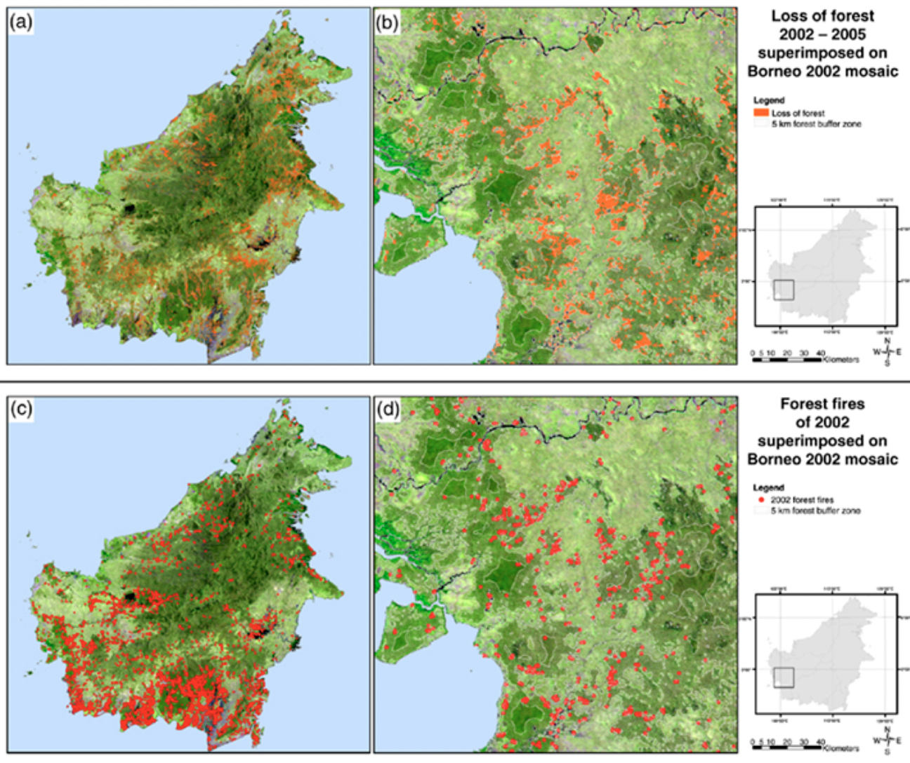

# These are my RS slides

.compliment[
.rstudio-blue[RS] is cool!
]

<style>
.compliment{
  text-align: center;
  font-size:2em;
  font-family: monospace;
  color: tomato;
}
.rstudio-blue{
 color: #4D8DC9;
}
</style>

.RS-box[

]

<style>
.RS-box{
  background-image: url(https://gisgeography.com/wp-content/uploads/2015/11/What-Is-Remote-Sensing-1.jpg);
  height: 50%;
  width: 60%;
  position: absolute;
  background-size:cover;
  right: 150px;
}
</style>

---
class: center, middle

# What is Remote sensing

Remote sensing provides information about objects at or near the surface of the Earth and atmosphere based on radiation reflected or emitted from those objects. The information is usually captured at a distance from above in the form of image data [(Kitchin et al. 2009)](https://hdl.handle.net/11245/1.399303). 


---
class: inverse, center, middle

# A Example

---

# Moderate Resolution Imaging Spectroradiometer (MODIS)

--

.pull-left[
* MODIS is a satellite-based sensor used for earth and climate measurements;

* There are two MODIS sensors in Earth orbit;

* One on board the Terra (EOS AM) satellite;

* And one on board the Aqua (EOS PM) satellite;

* MODIS has now been replaced by the VIIRS;

]

--

.pull-right[

* It has 36 spectral bands, 250-1000 meter resolution;

* And averages a **2-day** revisit period;

* Because of this versatility, MODIS has changed how we understand our land, ocean, and atmosphere;

* And due to its enormous coverage, it enables us to monitor activities such as active fires, land use change, and volcanic activity.

]

.footnote[[Source: GISGeography](https://gisgeography.com/modis-satellite/)]

---
class: center, middle

``` {r echo=FALSE, out.width='50%', fig.align='center'}


```

MODIS has the advantages of high temporal and hyperspectral resolution, medium-scale spatial resolution and free global reception. It has broad application prospects in many researches such as ecology, environmental monitoring, global climate change and agricultural resource survey.

---

# MODIS Uses and Applications

--

## Fire and Hot Spot Detection

The fire detection algorithm uses [MODIS to detect active fires](https://gisgeography.com/wildfire-maps-real-time/). Comparing temperature to neighboring pixels determines the severity and extent of the fire. If the difference is over a given threshold, it confirms the “hot spot” as an active wildfire. Giglio et al. [(2003)](https://doi.org/10.1016/S0034-4257(03)00184-6) proposed a new algorithm that can detect fires roughly half the minimum size that could be detected with the original algorithm while having an overall false alarm rate 10–100 times smaller.

``` {r echo=FALSE, out.width='40%', fig.align='center'}


```

.footnote[[Source: Around the World](https://gisgeography.com/wildfire-maps-real-time/)]

---
# MODIS Uses and Applications

## Land Cover

The MODIS instrument tracks land use change by examining its spectral properties over the land. Langner et al.[(2007)](https://doi.org/10.1111/j.1365-2486.2007.01442.x) investigated the current forest cover in Borneo and its changes between 2002 and 2005 using multitemporal MODIS image composites. The results of their study suggested that MODIS can be successfully used to monitor deforestation and forest degradation in Borneo and on other tropical forests of Southeast Asia.

``` {r echo=FALSE, out.width='40%', fig.align='center'}



```

---

# Reflection

--

1. For Xaringan: This is a great way to make slides. The appearance is beautiful, and the use of code for drawing greatly reduces the production time compared with the traditional method. Xaringan is especially useful for academic presentation slides. At the same time, for novices, they still need to learn some grammar. At present, I only master how to add  text and pictures in Xaringan. I still need to learn about embedding code and achieve interactive functions.

--

1. For MODIS: I learned that MODIS is a sensor that is carried on Terra and Aqua satellites. Compared with Landsat, it has more spectral bands, covering the full spectrum from 0.4 microns (visible light) to 14.4 microns (thermal infrared). This makes the application of MODIS data very extensive, and it can provide information reflecting land surface conditions, clouds, oceans, plants, and the atmosphere. For its application, I only know the basic land cover recognition and Fire and Hot Spot Detection so far, and I look forward to future studies.

---

# Reference

* Giglio, L., Descloitres, J., Justice, C. O. and Kaufman, Y. J. (2003). ‘An enhanced contextual fire detection algorithm for MODIS’. *Remote sensing of environment*. Elsevier, 87 (2–3), pp. 273–282.

* Kitchin, R. and Thrift, N. (2009). *International encyclopedia of human geography*. Elsevier.

* Langner, A., Miettinen, J. and Siegert, F. (2007). ‘Land cover change 2002–2005 in Borneo and the role of fire derived from MODIS imagery’. *Global Change Biology*. Wiley Online Library, 13 (11), pp. 2329–2340.


